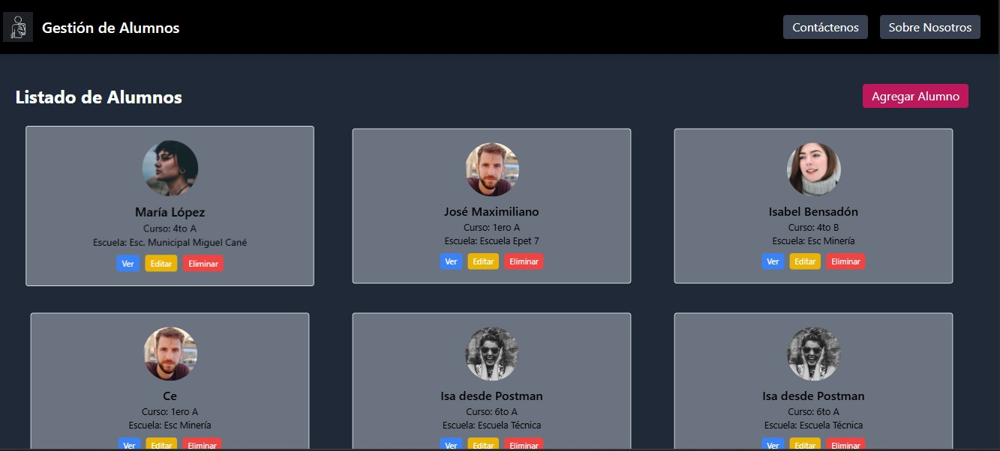

Gestión de Alumnos

Aplicación web para permitir una gestión moderna, visual y efectiva de alumnos de una institución educativa.

Tecnologías utilizadas

- ⚛️ React + Vite
- 💅 Tailwind CSS
- 🌐 React Router DOM
- 💾 MockAPI
- 🧠 Context API
- 📡 Axios
- 💬 SweetAlert2
- 🔔 React Toastify
- 🌀 Framer Motion

 Funcionalidades

- 📋 Ver listado de alumnos.
- 🔍 Ver detalle de cada alumno.
- ➕ Agregar nuevos alumnos.
- ✏️ Editar datos de alumnos.
- ❌ Eliminar con confirmación.
- ⚠️ Página 404 personalizada (con toast exagerado y humorístico).
- 📄 Secciones extra: Sobre Nosotros y Contáctenos.

Navegación

| Ruta | Funcionalidad |
| `/alumnos` | Lista de alumnos |
| `/alumnos/create` | Agregar alumno |
| `/alumnos/:id` | Ver detalle |
| `/alumnos/edit/:id` | Editar alumno |
| `/contacto` | Medios de contacto |
| `/sobre-nosotros` | Descripción del proyecto |
| `*` | Página 404 personalizada |

Captura de pantalla

 
En Netlify: https://gestionalumnosisa.netlify.app/alumnos

Autora
Creado por Isa, docente, mamá, profesional, y entusiasta de la tecnología educativa (y del caos con estilo, intentando educar no tan entusiastas adolescentes).
